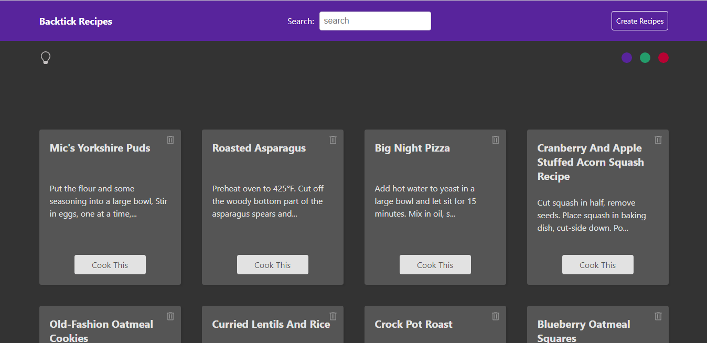

# Backtick Recipes

A website created with React that displays food recipes and also allows you to add your own recipes.

## Table of contents

- [Overview](#overview)
  - [The challenge](#the-challenge)
  - [Links](#links)
- [My process](#my-process)
  - [Built with](#built-with)
  - [Screenshots](#screenshots)
  - [What I learned](#what-i-learned)
  - [Continued Learning](#Continued-Learning)
- [Author](#author)

## Overview

### The challenge

My initial goal for this project was to create a complete standard site with multiple pages without any dummy hyperlinks; then I realized I could make it better by designing it for the kind of business that I hope to exist someday.

### Links

- Live Site URL: [Here](https://backtick-recipes.netlify.app/)
- Source code URL: [Here]((https://github.com/SageKyle/backtick-recipes)

## My process

### Built with

- React JS
- React Context and Reducer
- React Custom hooks
- React Router
- CSS
- Framer motion
- Firebase
- Json Server
- Javascript

### Screenshots

### What I learned

Through this project I learned a lot about routing in React, context and reducers, useParams, useEffect and a couple of other React functionalities. I also learned how to create custom hooks and theme/color toggle in React.

### Continued Learning

I intend to expand my knowledge In React by practicing more with the Context api and other complex React functionalities

## Author

- Github - [Paul Ominyi](https://github.com/SageKyle)
- Twitter - [@Ominyi_Sage](https://www.twitter.com/Ominyi_Sage)
